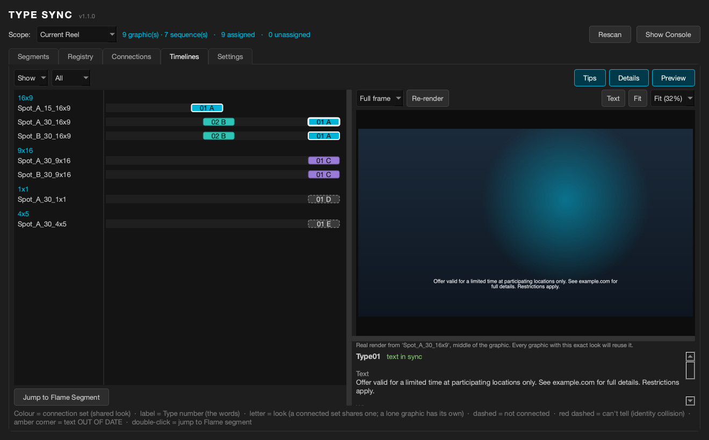

# Type Sync

A Flame 2026.1+ tool for managing the **text of Type (Timeline FX) graphics**
 across multiple sequences and aspect-ratio versions — and for managing the
**layout connections** between them — in a singular GUI.

Built with legal / disclaimer lines in mind for 16×9, 9×16, 1×1, 4×5, etc. 
while each aspect keeps its own framing. Works for any
Flame-generated Type graphic.

> Status: 1.1.0 — see the [Changelog](#changelog). Looking for testers; read
> [Known limitations](#known-limitations) before running it on production work.



---

## TLDR

- Generate a **Registry** of graphics by analyzing all timelines within a specified scope.
- Adjust the text whenever you need, and **Sync** those changes to every registered
  graphic at once without adjusting each segment's layout.
- Easily create **Segment Connections** across multiple Gap Type FX that share layout
  (position / scale / format), which you can then sync using Flame's built-in sync tools.
- *(1.1.0)* See every graphic on every timeline at a glance in the **Timelines** tab,
  with a preview rendered by Flame itself.

Text and layout are managed independently — change one without disturbing the
other.

---


## How it works

A per-project JSON **registry** is the single source of truth for each graphic's
text. Segments are assigned `graphicNN` and receive their text from the registry —
one-directional (registry → Type layers), so you edit text in one place
and push it everywhere. Layout (position / scale / format) is handled separately
through Flame's native **segment connections**, so text and layout stay
independent.

### Tabs

- **Segments** — this tab lists all segments with the Type TimelineFX applied
  within a pre-established scope & setting range. Assign segments to a Type number,
  group identical text (sort grouped by **In** for appearance order), and capture a segment's
  text into the registry — **Add All** seeds the whole registry from a grouped
  list in one click. (Assigning only creates an association between a segment and
  its corresponding text within the Type Sync tool; it doesn't change the text on your timeline
  until you explicitly hit Sync.) *(1.1.0)* **Sync Selected / Sync All** push registry
  text onto OUT OF DATE segments from here, with a preview.
- **Registry** — add / edit / remove graphic definitions (or **Remove All** to
  start fresh); Renumber with Swap/Overwrite; Sync Text to a scope.
- **Connections** — create / remove the native segment connections that share a
  graphic's layout between sequences of the same aspect. **Auto Connection**
  queues a connection group for every like-aspect / like-Type set automatically —
  new segments **join** an existing connected set (shown as `Q1 → A`) without
  re-copying it; review, then Execute Queue. A group that won't run is marked ⚠
  (hover to see why). **Set as Source** marks which segment's layout is the master. After a run, every
  affected sequence is parked at its first frame and you're returned to where you
  started. *(1.1.0)* **Every look has a letter**: a connected set shares one, a lone
  segment has its own (after Z come AA, AB, …). **Execute Queue** double-checks
  Flame first and asks you to press again if anything changed since you reviewed it.
- **Timelines** *(1.1.0)* — every sequence as a lane (grouped by aspect) and every
  Type graphic as a block where it sits in the cut: colour/letter = its look
  (connection set), number = its Type number, dashed = not connected, red dashed = two
  graphics the tool can't tell apart, an amber corner = text OUT OF DATE.
  **Show** / **Filter** + a Type number: Show greys out everything but that Type,
  Filter also leaves out the sequences that don't use it. **Tips** shows / hides
  the key at the bottom (the Connections tab has its own Tips button). Click a
  graphic to light up its whole set and see its text, where it is and what it's
  connected to; double-click it (or press **Jump to Flame Segment**) to open its
  sequence in Flame with the positioner parked in the middle of the graphic.
  - **Preview** — a render of the graphic straight from Flame (see
    [The Timelines preview](#the-timelines-preview)). **Full frame** shows the
    whole frame, picture and all; **Type only** shows just the Type over black,
    and is quick however heavy the timeline is. **Re-render** renders it again.
  - **Getting in close** — the zoom list (Fit, 25–400% of the frame's own pixels;
    100% = 1:1, as in Flame's viewer), **Fit**, and **Text**, which frames the
    graphic's words. The mouse wheel zooms about the pointer, dragging the picture
    pans, and double-clicking it goes back to Fit. The zoom list turns amber once
    you're past the preview's own pixels (where it starts to look soft) — a
    bigger **Preview size** lets you zoom further before that happens. Each
    frame size (1x1, 4x5, 16x9…) keeps its own zoom, remembered between opens.
  - **Panes** — drag the dividers to make the sequence names, the lanes or the
    picture the focus. **Preview** (top row) shows / hides the whole preview
    pane and **Details** the details under the picture; with the preview
    hidden, nothing is rendered. The layout is remembered between opens.
- **Settings** — assign the settings folder for the registry .json file, default scope, what counts as a target segment
  (match mode + name / track filters), Segments-tab defaults (Grouped Text +
  default sort), getting-started tips, and *(1.1.0)* **Preview size** for the
  Timelines preview. *(1.1.0)* There's no Save button: changes are saved as you
  leave the tab (or close the window).

### The Timelines preview

The picture in the Timelines tab is a JPEG that **Flame renders itself**,
so the text, font and line breaks are exactly what Flame draws.

- **Full frame** — Type Sync puts temporary In/Out marks around the middle frame
  of the graphic on its sequence, exports that one frame with a copy of Flame's
  own JPEG export preset (set to your Preview size), then puts your marks back.
  It's quick when the timeline is rendered.
- **Type only** — Type Sync saves the graphic's Type setup to a temporary
  file, makes a temporary one-track sequence of the same format in the first
  Desktop reel (`type_sync_preview_tmp`), adds a Type to it, loads the setup,
  exports its middle frame the same way, and deletes the temporary sequence and
  file. Your sequence isn't touched (not even its marks) and none of your
  segments are copied, so no connection set is ever joined. In testing it took
  about half a second, however heavy the picture under the graphic is.
- **Preview size** (Settings) — how big that JPEG is, on its long side:
  **Native** (the sequence's own size — the default), **4K (3840 px)**,
  **HD (1920 px)** or **720 px (fastest)**. It's never bigger than the sequence
  itself. Flame renders the frame at the sequence's full size either way and
  shrinks it as it writes the JPEG, so a bigger preview means sharper text when
  you zoom in, for a little more time and disk per render. Pick it in Settings;
  it's saved as you leave the tab, and the next preview uses it.
- **Cache** — each render is kept in `preview_cache`, in the registry folder,
  under a fingerprint of everything that decides how the graphic looks (every
  Type layer setting including the text, the Type's own settings, whether it's
  hidden, the frame size, the mode and the Preview size). Every graphic with
  that exact look reuses the one render, so it's made **once per look**; change
  the graphic in Flame (its text, position, size…) and the next click renders a
  fresh one. The picture under it isn't part of the fingerprint (see
  [Known limitations](#known-limitations)). Each Preview size is cached
  separately. Old renders are pruned automatically.


## Installation

Copy the single file into its own folder on Flame's shared Python path and
restart Flame:

```
/opt/Autodesk/shared/python/type_sync/type_sync.py
```

> **Upgrading from GFX Sync (`gfx_sync.py`) or an early `graphic_sync.py`?**
> Delete the old **install** file and its folder first
> (`/opt/Autodesk/shared/python/gfx_sync/`). Flame loads every `.py` under its
> shared python path, so leaving both behind gives you duplicate menu entries and
> two copies of the tool competing for the same registry.
> **Don't** delete the `gfx_sync` folder inside your projects' setups: it holds
> your registry. Type Sync reads it and copies it to its new name
> (`type_sync/type_registry.json`) the first time it opens that project; your
> settings carry over too, so nothing is lost. Old previews are simply rendered
> again once.


## Usage

Live Demo (start at 33:59)
https://www.youtube.com/live/6LVJW1oSP2Y?si=D-U1ha69K97QVl_O&t=2039

Open it from any of:

- Right-click a timeline segment → **Type Sync → Type Sync…**
- Right-click in the Media Panel → **Type Sync → Type Sync…**
- Flame main menu → **Type Sync → Open Manager…**

*(1.1.0)* The window doesn't block Flame: keep working with it open, and press
**Rescan** (on the Scope row) after changing things in Flame.

Typical flow:

1. **Segments** — assign segments to `Type01`, `Type02`, … (the "Grouped Text"
   toggle folds identical text so you can assign many at once).
2. **Registry** — make a change to a registered text field, hit Save/Add, and hitting **Sync Text → Scope** pushes it to
   every registered segment (with a preview). Use a line of `---` to separate Type
   layers. A segment whose text no longer matches its registry entry shows
   **OUT OF DATE** in the Segments tab (fix it there with **Sync Selected / Sync All**).
3. **Connections** — **Auto Connection** → review the queued groups → **Execute
   Queue** to share layout between sequences of the same aspect.
4. **Timelines** — check where every graphic sits and how it's connected, and
   preview it.

Scopes (top of the window): **Selected · Current Sequence · Current Reel ·
Current Reel Group · All Sequences Reels**. The "Current …" scopes follow what's
open in Flame's **Timeline** tab (the tool switches you there on open).

## Known limitations

- **Flame 2027 testing environment only.** Built and tested against 2027.0 and 2027.1. It MOST LIKELY runs on
  2026.1+ (the Type Python API arrived in 2026.1), but that hasn't been tested —
  if you try it on 2026, please report any issues.
- The add-layer path for growing a Type to more layers tries a set of candidate
  API calls, guarded by a layer-count readback — text is only written to a layer
  index after the readback confirms it exists. It works in practice, but it isn't
  pinned to a single documented call, so on an unusual Type setup it may decline
  to add layers and warn instead of silently losing text.
- Aspect ratio is detected from the sequence name first (`_16x9_`, `9x16`, …),
  falling back to the width/height ratio. Sequences whose names carry no aspect
  token and whose ratio isn't one of 16×9 / 9×16 / 1×1 / 4×5 may be mislabelled —
  which matters because Auto Connection groups by aspect. Name your sequences with
  an aspect token and this never comes up. If you find mislabeling happening, 
  we may need to introduce a more manual way of assigning aspect ratios to sequences.
- **Type only is the text over black.** A graphic whose look depends on the
  picture underneath looks different there — switch to **Full frame** to see it
  in place.
- **Type only briefly makes and deletes a sequence** named
  `type_sync_preview_tmp` in the first Desktop reel. Flame's **Undo** can bring it
  back; it's harmless — just delete it by hand. (If it ever can't be deleted, the
  console says so.)
- **Text framing is an estimate** from the Type's settings (position, scale, box
  width, font size and how long the text is), not measured from the render, so
  on an unusual layout it may be a little off — zoom or drag to adjust.
- **Previews are cached per look** in the registry folder's `preview_cache`. The
  picture under a graphic isn't part of its look, so after changing the picture,
  press **Re-render** to see it in Full frame. The folder can be deleted any time;
  previews are rebuilt as you click.


## Changelog

### 1.1.0
- **Renamed: GFX Sync is now Type Sync.** It works with Flame's Type only, so it's
  named for it, and graphic numbers are now `Type01`, `Type02`, … Install the new
  `type_sync` folder and **delete the old `gfx_sync` install folder** (not the
  `gfx_sync` folder in your projects' setups — that's your registry, which Type
  Sync picks up and copies to its new name automatically, along with your
  settings).
- **Type Sync no longer blocks Flame.** Work in Flame with the window open; press
  **Rescan** (on the Scope row) after changing things there. Reopening from the
  menu builds a fresh window (an unexecuted queue and Set as Source marks are cleared, and it
  says so).
- **Sync Selected / Sync All** in the Segments tab: fix OUT OF DATE right where you
  see it. Sync Selected pushes the registry text to every segment sharing the
  selected rows' Type number(s), in every aspect; Sync All does the whole Scope. Both
  show every old → new change first and ask. Greyed out until the registry has text.
- **Execute Queue double-checks Flame first.** If anything changed since you
  reviewed the queued rows, it redraws them and asks you to press again.
- **A letter for every look** in the Connections tab (and the Timelines tab): a
  connected set shares one, a lone segment has its own. After Z come AA, AB, ...
- **New Timelines tab.** Every sequence as a lane (grouped by aspect), every Type
  graphic as a block where it sits in the cut. Colour and letter = its look
  (connection set), number = its Type number; dashed = not connected; an amber corner =
  text OUT OF DATE. Click a graphic to light up its whole set and see its text, where
  it is and how many looks that Type number has; double-click (or **Jump to Flame
  Segment**) to jump Flame there. Drag the divider to widen the sequence names
  (double-click it to fit).
- **Preview** in the Timelines tab, rendered by Flame itself: **Full frame** (the
  whole frame, picture and all) or **Type only** (just the Type over black —
  quick however heavy the timeline is). About a second or less the first time, then
  cached once per distinct look; **Re-render** makes a fresh one.
- **Zoom and pan the preview:** the zoom list (Fit, 25–400%; 100% = 1:1, as in
  Flame's viewer), **Fit**, **Text** (frames the graphic's words), the mouse wheel,
  drag to pan, double-click to Fit. The zoom list turns amber when you're past the
  preview's own pixels. Each frame size keeps its own zoom (remembered).
- **Resizable, hideable panes.** Drag the dividers to make the names, the lanes or
  the picture the focus; **Preview** and **Details** show / hide the picture and
  the details under it (with the preview off, nothing is rendered). The layout,
  the console and the window size are remembered between opens.
- **Preview size** (Settings): Native (the sequence's own size — the default),
  4K (3840 px), HD (1920 px) or 720 px (fastest) — never bigger than the
  sequence. Bigger = sharper text when you zoom in, for a little more time and
  disk per render. Each size is cached separately.
- **Settings save themselves** as you leave the Settings tab (or close the
  window) — no more Save button.
- **Show / Filter** in the Timelines tab (Filter lists only the sequences that use
  the chosen Type), and **Tips** buttons on the Connections and Timelines tabs.

### 1.0.1
- **Version shown in the window header**, so you can tell which build you're on.
- **Auto Connection handles new segments joining an existing connected set.**
  Previously a single new segment was silently dropped (the console said
  "queued" but nothing appeared), and two or more new segments caused the
  already-connected ones to be re-copied. Now the new segments join the set,
  and only they are replaced.
- **The queue shows exactly what will run.** The Q rows, Execute Queue and the
  Multi Segment Connection confirm box all use the same plan, so "Yes" (run now)
  and "Queue" (run later) always do the same thing. Groups that can't run are
  marked ⚠ with the reason.
- **Safer segment identity.** Flame doesn't give segments an ID, so the tool
  identifies them by sequence, name, In, reel and reel group. A same-named copy
  of a sequence in another reel is no longer mistaken for the live one. If two
  graphics still can't be told apart (e.g. a legal and a super starting on the
  same frame in one sequence, both unnamed), the scan warns you and the tool
  won't connect them — give one a segment name to fix it.
- **Split sets are reported, not guessed.** If one Type number in one aspect is already
  split across two separate connected sets, Auto Connection tells you and leaves
  it alone; which layout wins is your call.
- **Set as Source** now works when the marked segment is anywhere in the set
  being joined, and a Set as Source that would split a set is refused with an
  explanation.
- **Break Selected clears the queue**, since the connections it was planned on
  just changed.
- **Cleanup of temporary copies.** Connecting makes a temporary copy of the
  master graphic in the reel; it's now deleted the way Flame requires from a
  script, and any copy that can't be removed is reported in the console. If you
  ever find stray copies of your graphics in a sequences reel after connecting,
  they're safe to delete.

### 1.0.0
- First public release.

## Credits

Written by **Jeff Kyle**. Built with Claude (Anthropic).

## License

Provided as-is, without warranty of any kind. Free to use and modify.
